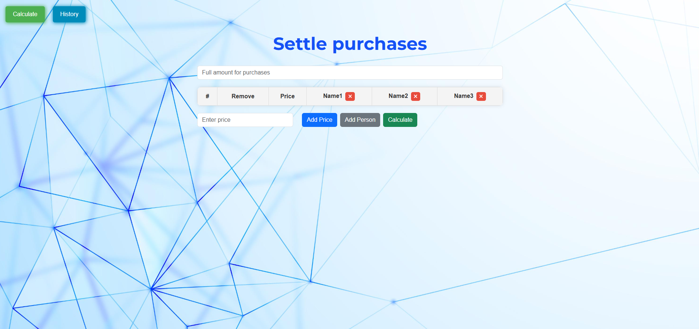
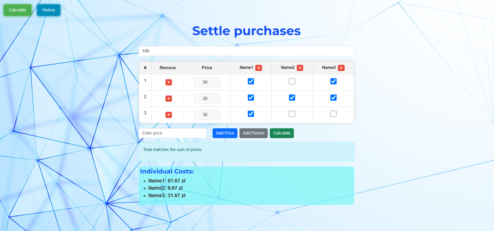
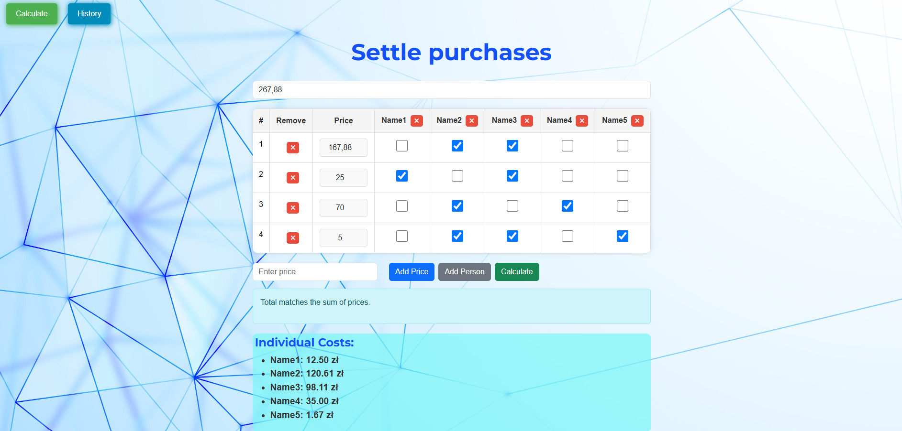
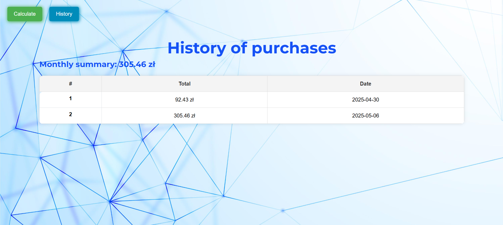

# Reckoning Web App

### Web Application for reckoning purchases

This application was created to settle purchases. It makes it much easier to sum up the costs of each person who contributed to the purchases in order, for example, to return the appropriate amount to the person who paid for the purchases.

#### Used technologies:

* Frontend - React (JavaScript)
* Backend - Flask (Python)

#### How to start application?

1. Clone this repository 
   ```
    git clone https://github.com/Tomaszek03/Reckoning_web_app.
   ```
2. Run backend (recommended in a virtual environment):
    ```
    cd backend
    python app.py
    ```
3. Run fronend (in separate terminal):
   ```
   cd frontend
   npm run dev
   ```
4. Your application is available in the browser under the link that will appear after launching

#### Principle of operation:

1. Add the names of people who participated in the purchases (by default there are 3 names - you can delete them and also newly added ones)
2. Enter the full amount for your purchase in the box above the table
3. Add prices for individual products
4. Check the checkbox under the names of the people who bought the product
5. Press the "Calculate" button.

The application ensures validation of entered data (e.g. the price cannot be negative or equal to zero)

The program will verify the total costs for each person by comparing it to the total given at the beginning and will display information whether everything is correct. 
It will display information about who paid how much for their share of purchases. 

If the calculated total matches the amount entered at the beginning, this total will be saved in the database (SQLite), so you can control your shopping expenses. Additionally, the total costs for the current month are displayed above the table in the shopping history.


#### Example screenshots from application:








